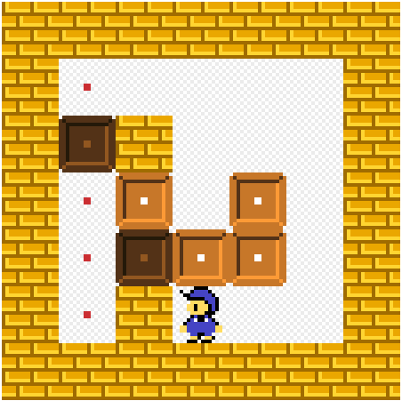

# Sokoban-AI-solver
Bot that was made to solve Sokoban puzzles [here.](https://www.sokobanonline.com/) </br>
[An example puzzle. ](https://www.sokobanonline.com/play/web-archive/marti-homs-caussa/choriban/86887_choriban-20)


### How does it work?
1. Download the map canvas and convert it to B&W.
2. Map blocks by counting pixels to get simple .txt version of the map.
3. Now BFS based algorithm can use this .txt map to find a way to solve the puzzle!


### How to use it.

<p align="center">
  
</p>

First you need to download the map. </br>
You can use this script, (it's also included in project files `get_canvas.js`). </br>
Type it in page inspect console. </br>

```
const result = document.querySelectorAll("canvas")
const dataUrl = result[0].toDataURL('image/png').replace("image/png", "image/octet-stream");
window.location.href = dataUrl;
```

After that you need to install all required libraries in `Solve.py` </br>
Run `sudo python Solve.py` to start the program. </br>

TODO: </br>
Better blocks mapping, because now it works only when blocks are 64 x 64. </br>
Faster BFS or A* </br>

