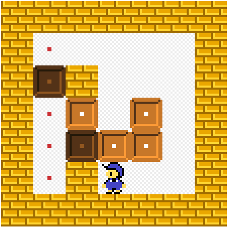

# Sokoban-AI-solver
> Agent that solves Sokoban puzzle.


## Table of contents
* [General info](#general-info)
* [Screenshots](#screenshots)
* [Libraries](#Libraries)
* [How does it work?](#How-does-it-work?)
* [How to use it?](#How-to-use-it?)
* [TODO](#todo)


## General info
Bot that was made to solve Sokoban puzzles on [this](https://www.sokobanonline.com/) website. </br>
An example puzzle[here.](https://www.sokobanonline.com/play/web-archive/marti-homs-caussa/choriban/86887_choriban-20)

## Screenshots
<p align="center">
  
</p>

## Libraries
* sys
* numpy
* keyboard
* Image
* os

## How does it work?
1. Downloads the map canvas and changes it to B&W.
2. Maps pixels to txt characters.
3. Maps every k x k block tile to single character.
4. Now BFS based algorithm can use this .txt map to find a way to solve the puzzle!


## How to use it?
First you need to download the map. </br>
You can use this script, (it's also included in project files `get_canvas.js`). </br>
I use https://tampermonkey.net/ to make it faster. </br>
Type it in Web inspector console. </br>

```js
const result = document.querySelectorAll("canvas")
const dataUrl = result[0].toDataURL('image/png').replace("image/png", "image/octet-stream");
window.location.href = dataUrl;
```


After that you need to install all required libraries in `Solve.py` </br>
Run `sudo python Solve.py` to start the program. </br>

## TODO
Better blocks mapping, because now it works only when blocks are 64 x 64. </br>
Another BFS based algorithm or A* running as parallel thread. </br>
Maybe do all with only one script. </br>
